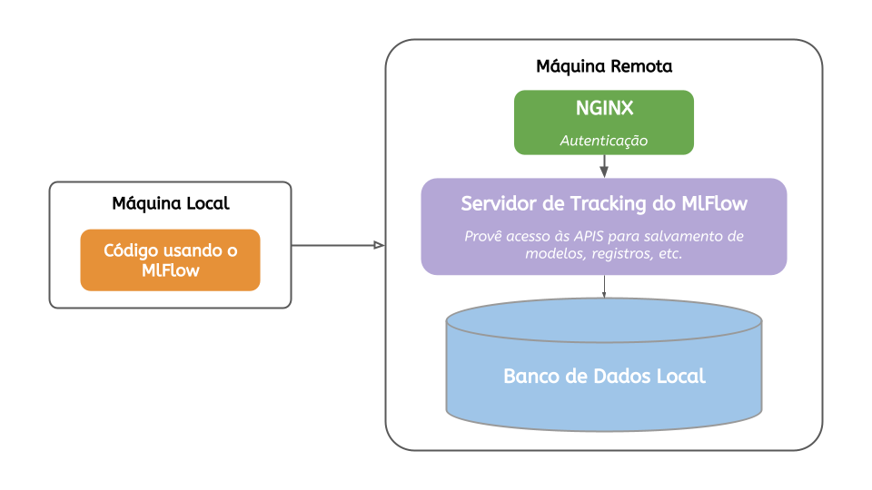
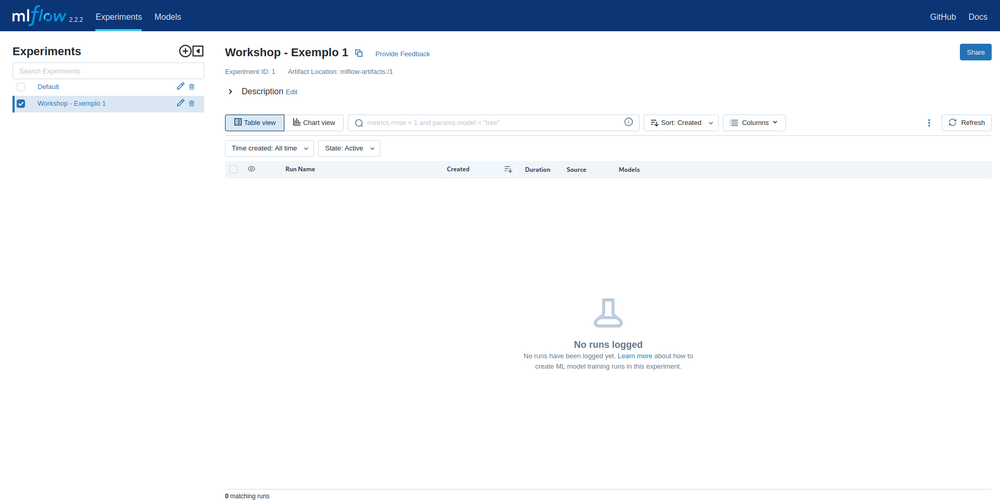

# Prática: MlFlow

Na *Parte II* das atividades práticas do Workshop, vamos aprender a utilizar MlFlow para armazenar os resultados dos nossos experimentos, bem como os modelos produzidos como saída.

O intuito é familiarizar todos os cientistas, pesquisadores e desenvolvedores em como manter sempre registrado os resultados de suas experimentações.

## Organização do MlFlow para o Workshop

Para o Workshop, o MlFlow foi implementado de forma mais simples em uma Máquina Virtual (VM) do GCP. O acesso é feito através de uma autenticação simples (gerenciada pelo NGINX) e todos as métricas/modelos/artefatos são salvos na VM.

## Credenciais de Acesso

Para acessar o servidor remoto de tracking do MlFlow, são necessárias algumas credenciais. 

Acessando essa página através do navegador, temos acesso à interface geral do MlFlow.

